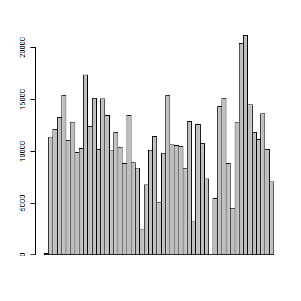
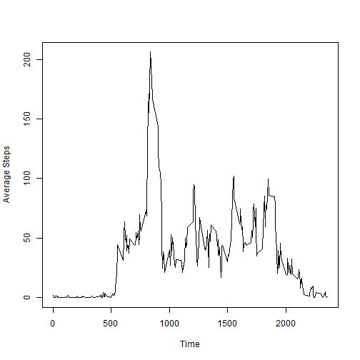
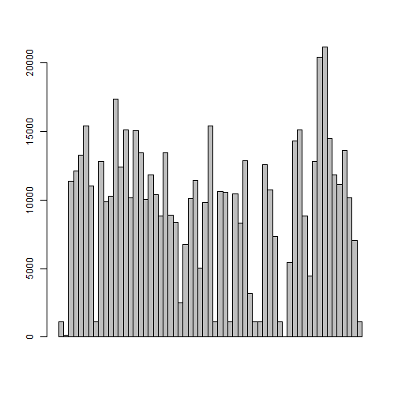
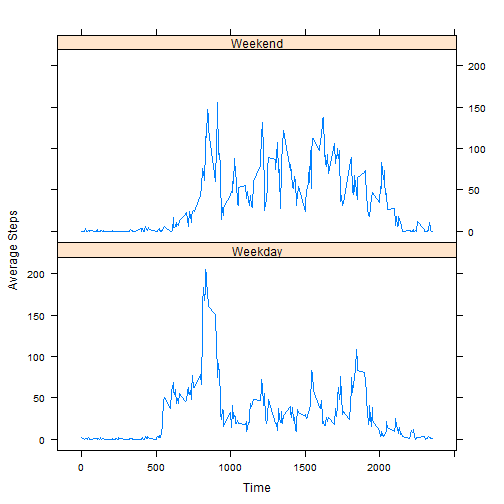

#  Reproducible Research
## Assignment 1

Read the data into a data table.


```r
d <- read.table('repdata_data_activity/activity.csv', sep = ',', header = TRUE, na.strings = 'NA')
origNames <- names(d)
d$datetime = strptime(d$date, '%Y-%m-%d')
```

Calculate the total steps taken in a day.


```r
tot <- aggregate(steps ~ date, d, sum)
names(tot) <- c("Date", "Steps")
head(tot)
```

```
##         Date Steps
## 1 2012-10-02   126
## 2 2012-10-03 11352
## 3 2012-10-04 12116
## 4 2012-10-05 13294
## 5 2012-10-06 15420
## 6 2012-10-07 11015
```


Create a histogram


```r
tot$datetime = strptime(tot$Date, '%Y-%m-%d')
barplot(tot$Steps, space = 0)
```




Mean and median


```r
stepsmean <- mean(tot$Steps)
print(stepsmean)
```

```
## [1] 10766.19
```

```r
stepsmedian <- median(tot$Steps)
print(stepsmedian)
```

```
## [1] 10765
```

Plot the average number of steps in each interval across all days


```r
avg <- aggregate(d$steps ~ d$interval, d, mean)
names(avg) <- c("Interval", "Mean")
plot(avg$Interval, avg$Mean, type = "l", xlab = "Time", ylab = "Average Steps")
```



Maximum number of steps in a 5 minute interval

```r
print(avg[avg$Mean == max(avg$Mean),])
```

```
##     Interval     Mean
## 104      835 206.1698
```


Number of rows with missing data


```r
NAs <- d[is.na(d$steps),]
print(nrow(NAs))
```

```
## [1] 2304
```

Impute missing data using median calculated from available data


```r
med <- aggregate(d$steps ~ d$interval, d, median)
names(med) <- c("Interval", "Median")
dWithMed <-merge(d, med, by.x = "interval", by.y ="Interval")
dWithMed$imputedSteps = ifelse(is.na(dWithMed$steps), dWithMed$Median, dWithMed$steps)
ordereddata <- dWithMed[order(dWithMed$date, dWithMed$interval), ]
Imputeddata <- ordereddata[, c(6, 3, 1)]
names(Imputeddata) <- origNames
head(Imputeddata)
```

```
##     steps       date interval
## 1       0 2012-10-01        0
## 63      0 2012-10-01        5
## 128     0 2012-10-01       10
## 205     0 2012-10-01       15
## 264     0 2012-10-01       20
## 327     0 2012-10-01       25
```

Create a histogram


```r
tot2 <- aggregate(steps ~ date, Imputeddata, sum)
names(tot2) <- c("Date", "Steps")
barplot(tot2$Steps, space = 0)
```



Mean and median


```r
print(mean(tot2$Steps))
```

```
## [1] 9503.869
```

```r
print(median(tot2$Steps))
```

```
## [1] 10395
```

Compare activity during weekdays vs. weekends


```r
Imputeddata$datetime = strptime(Imputeddata$date, '%Y-%m-%d')
Imputeddata$day <- weekdays(Imputeddata$datetime)
Imputeddata$weekend <- ifelse(Imputeddata$day=="Saturday" | Imputeddata$day=="Sunday","Y","N")

avgWeekDay <- aggregate(steps ~ interval, Imputeddata[Imputeddata$weekend == 'N',], mean)
avgWeekDay$weekend = as.factor('Weekday')
avgWeekEnd <- aggregate(steps ~ interval, Imputeddata[Imputeddata$weekend == 'Y',], mean)
avgWeekEnd$weekend = as.factor('Weekend')
avg2 = rbind(avgWeekDay,avgWeekEnd)
head(avg2)
```

```
##   interval      steps weekend
## 1        0 2.02222222 Weekday
## 2        5 0.40000000 Weekday
## 3       10 0.15555556 Weekday
## 4       15 0.17777778 Weekday
## 5       20 0.08888889 Weekday
## 6       25 1.31111111 Weekday
```

```r
library(lattice)
xyplot(steps~interval|weekend,
       data=avg2,
       type="l",
       layout=c(1,2),
       xlab = "Time",
       ylab = "Average Steps",
)
```



